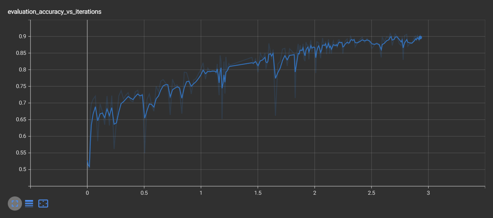
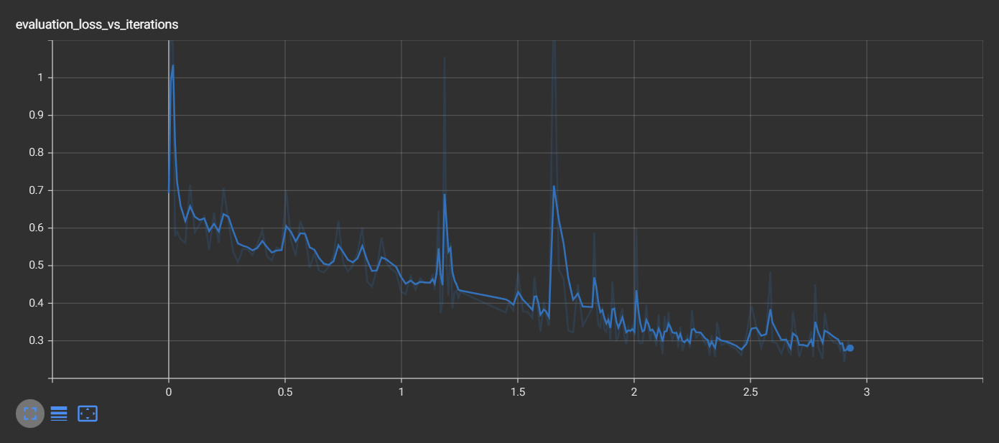

# SiameseNN

#### Cиамская нейронная сеть для сайта [ucoin.net](ucoin.net)

[](https://github.com/mixma5ter)

Модель построена на основе двух сверточных сетей (CNN), с одинаковыми весами и архитектурой.

На вход модель принимает два изображения и возвращает коэффициент сходства изображений от 0 до 1.

Отличается от аналогичных нейронных сетей тем, что обучается на небольшом количестве данных.

### Технологии

* Python 3.7
* Jupyter
* Tensorflow
* Keras
* Keras-tuner
* Numpy
* Pillow

### Описание

* `images_prep` - подготовка изображений
* `data_prep` - подготовка данных
* `model_tuner` - оптимизация гипер-параметров
* `siamese_nn` - создание и обучение сети
* `images` - папка для пользовательских изображений
* `data` - папка с подготовленными данными изображений

Для обучения модели на своих изображениях в папке `images` создать каскад папок, в каждой из которых лежат изображения одного класса.

Пример:
```
images
   |_____s1
   |   |_____1.jpg
   |   |_____2.jpg
   |   |_____ ...
   |   |_____10.jpg
   |_____s2
   |_____s3
   |_____ ...
   |_____s40
```

### Метрики сети




